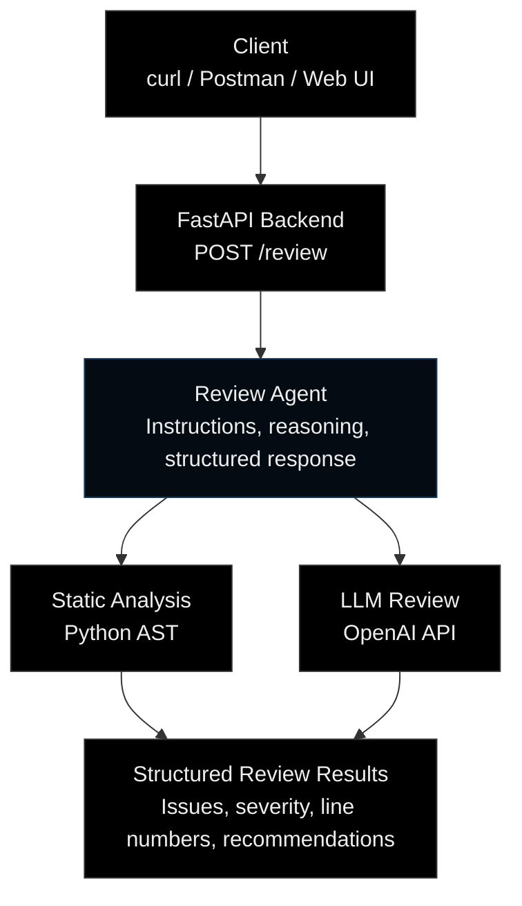

# Python Code Review Agent — Milestone 1

A beginner-friendly FastAPI project that runs Python AST syntax checking and then uses an LLM to return structured code review findings. This first version uses a fixed pipeline, not autonomous tool calling.

## Architecture

We'll start with a simple pipeline and later evolve it into a tool-using agent.



In this milestone, the review pipeline runs the AST syntax check first. Syntax
errors return immediately as structured findings; valid code proceeds to the
OpenAI API for an LLM review.

## What we achieved and what we learned

This app is a small but realistic example of how to build an AI-powered backend in Python.

We achieved a working flow where:

- a client sends Python source to a FastAPI endpoint,
- the server validates the request body using Pydantic,
- the code is checked with Python's `ast` module before any AI call,
- valid code is sent to an LLM for a structured review,
- the API returns a clean JSON response with findings, severities, and suggestions.

The main learning goals are:

- building a minimal web API with FastAPI and route design,
- validating request/response models with Pydantic,
- using Python AST for safe syntax validation without executing user code,
- integrating an LLM through `AsyncOpenAI` in a non-blocking async flow,
- handling environment variables for secrets like `OPENAI_API_KEY`,
- returning structured results instead of raw text,
- testing the app with real HTTP requests and basic endpoint checks.

This project is intentionally simple and educational: it gives a solid foundation for moving from a basic AI service to a more advanced agent that includes tools, retries, auth, logging, rate limiting, and production-ready safeguards.

## Run on macOS/Linux

```bash
python3 -m venv .venv
source .venv/bin/activate
pip install -r requirements.txt
cp .env.example .env
# Edit .env and set your OPENAI_API_KEY
uvicorn app.main:app --reload
```

## API documentation

After starting the server, open:

- Swagger UI: http://127.0.0.1:8000/docs
- ReDoc: http://127.0.0.1:8000/redoc
- OpenAPI schema: http://127.0.0.1:8000/openapi.json

In Swagger UI, expand `POST /review`, click **Try it out**, edit the example
`code` field, and click **Execute**. AI reviews require `OPENAI_API_KEY` in
your `.env`; health checks and syntax error findings work without it.

## Test

```bash
pytest -q
```

## Example

```bash
curl -X POST http://127.0.0.1:8000/review \
  -H 'Content-Type: application/json' \
  -d '{"code":"def divide(a, b):\n    return a / b"}'
```

## Learning notes

- `ast.parse` checks syntax without running untrusted code.
- Pydantic models validate request and response shapes.
- `AsyncOpenAI` avoids blocking the event loop while waiting for the model.
- Never commit `.env`; avoid submitting secrets or private code to an external model.
- This is a teaching project: before public deployment, add authentication, rate limiting, size/token limits, request logging controls, and more robust exception handling.
